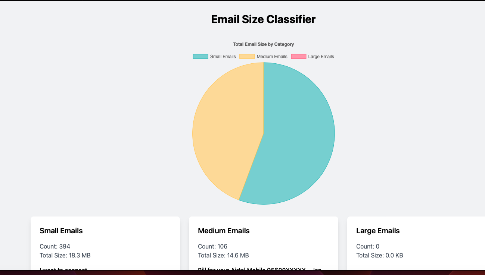

# gmail-size-classifier

[](https://codeium.com)

This web application connects to your Gmail account and classifies your emails based on their sizes into three categories: Small, Medium, and Large. It processes the first 1000 emails, and generates a web page like this:



Here is a small video about the initial version of this project

[](https://www.youtube.com/watch?v=o4315MIy5RU)

## Setup Instructions

1. Set up Google Cloud Project and Gmail API:
   - Go to the [Google Cloud Console](https://console.cloud.google.com)
   - Create a new project
   - Enable the Gmail API
   - Configure the OAuth consent screen
   - Create OAuth 2.0 credentials (Web application type)
   - Download the credentials and save them as `credentials.json` in the project root

2. Install dependencies:
   ```bash
   pip install -r requirements.txt
   ```

3. Run the application:
   ```bash
   python app.py
   ```

4. Open your browser and navigate to `http://127.0.0.1:5000`

## Size Classifications

- Small: Less than 100KB
- Medium: 100KB to 1MB
- Large: More than 1MB

## Security Note

The application uses OAuth 2.0 for authentication and only requests read-only access to your Gmail account.
